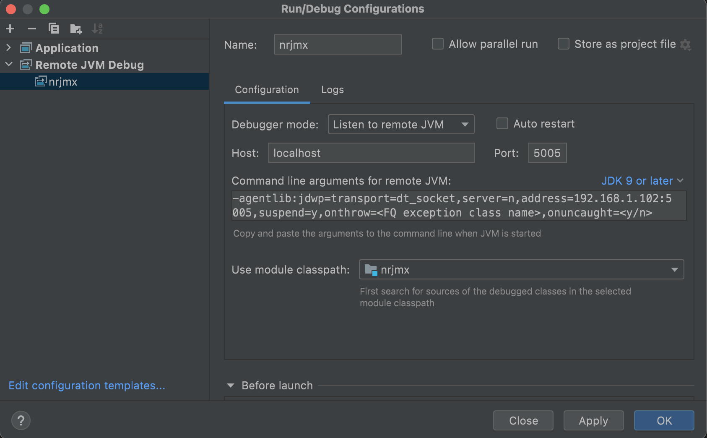

# About `nrjmx`

`nrjmx` is a Java tool that can be used to collect metrics from any application that has exposesd the JMX endpoint. In `nrjmx v1`
, the tool will output to stdout all the collected metrics in JSON format.

`nrjmx v2` implements a new communication protocol to ease data transfer to another language. Currently, `nrjmx v2`
provides support for Go using `gojmx` module from this repo.

To switch from `v1` to `v2` just pass `-v2` flag when running `nrjmx` command. Communication is handled by thrift.
For testing you can configure the `gojmx` module to point to this repository bin directory and use nrjmx.jar from there:
```go 
func init() {
	_ = os.Setenv("NR_JMX_TOOL", filepath.Join(testutils.PrjDir, "bin", "nrjmx"))
}
```

When calling `gojmx` module from a golang application, `nrjmx` library should be installed on the system.

To install `nrjmx` library on your system, packages are available on this repository in the release assets or on our
package manager repositories stored [here](https://download.newrelic.com/infrastructure_agent/). You can follow
this [documentation](https://docs.newrelic.com/docs/infrastructure/install-infrastructure-agent/linux-installation/install-infrastructure-monitoring-agent-linux/#ubuntu-repository)
to include our repository into your package manager.

`nrjmx` library is also available as
a [tarball](https://download.newrelic.com/infrastructure_agent/binaries/linux/noarch/).

# Installing `gojmx` module

You can use `gojmx` in your project by running `go get` command:

    go get -u github.com/newrelic/nrjmx/gojmx

Next, import the dependency into your application:

```go
import "github.com/newrelic/nrjmx/gojmx"
```

For more information about how to use `gojmx` you can check
the [example](https://github.com/newrelic/nrjmx/blob/jmx_improvements/gojmx/README.md).

# Contributing

Requirements:

- Go (v1.16+)
- Java (v1.8+)
- Maven (If running the Java project from IDE is required)
- Docker (for tests and build)

If you want to contribute to `nrjmx v2` you can follow the following steps to configure you're environment.

1. For Go module, import the path .nrjmx/gojmx into your IDE.
2. For the Java project, open an existing project and choose this repository root path where the pom.xml file is
   located. Choose Maven as the project type.

Running the solution from the debugger:

In order run the debugger for the solution e2e, we need to connect with the java debugger remotely to the process
started by
`gojmx` module.

Build the helper docker images by running the following command (required just the first time):

```bash
make go-test-utils
```

Build the Java project by running the following command (required everytime when a change is applied in the Java code or
in the thrift protocol):

```bash
make build
```

Choose from your Java IDE `Remote JVM debug` and configure it to `Listen to a remote JVM`:



Then from the Application.java function run Main in `debug` mode.

From the Go IDE, choose a test from gojmx_test.go to run, make sure you uncomment the following line from the init
function:

```go
_ = os.Setenv("NRIA_NRJMX_DEBUG", "true")
```

This environment variable is required to configure the `nrjmx` to allow the Java debugger to connect. If you want to
debug the code examples provided in the repo, you will also have to set this variable.

Click the `debug` button for the chosen test. Each test will spawn a docker container with a JMX service that provides
metrics.

When the Go test finished, the Java debug process will also exit.

# Spawning a JMX test Service.

In this project we provide a test-server that can be used inside a docker container to provide JMX metrics. You can find
information about how to use it [here](https://github.com/newrelic/nrjmx/blob/master/test-server/README.md)

You can easily spawn the container by running the following commands:

```bash
make go-test-utils
docker run -d -p 7199:7199 -p 4567:4567 test-server
```

If you need to configure SSL you can check the gojmx_test.go examples or
the [documentation](https://github.com/newrelic/nrjmx/blob/master/test-server/README.md)

# Changing the thrift interface

To change the `nrjmx` communication protocol, modify the `./commons/nrjmx.thrift` file and run the following command:

```bash
make code-gen
```

This command will generate the code for both: `gojmx` project and `nrjmx` project. Is running inside a docker container
so no dependencies are required. Push the changes for the generated files on your branch to make sure `go get` command
doesn't fail.

The implementation of the interface can be found here:
`./nrjmx/src/main/java/org/newrelic/nrjmx/v2/JMXServiceHandler.java`

# Updating Golang version

In order to update the Go version, you need to change the version in the following places:

1. ./build/Dockerfile change `GO_VERSION` variable
2. go.mod
3. .github/workflows/*

# Updating Thrift version

In order to update the thrift version, you need to change the version in the following places:

1. ./commons/Dockerfile
2. pom.xml
3. go.mod using `go get` command